# Frontend Mentor - Space tourism website solution

This is a solution to the [Space tourism website challenge on Frontend Mentor](https://www.frontendmentor.io/challenges/space-tourism-multipage-website-gRWj1URZ3). Frontend Mentor challenges help you improve your coding skills by building realistic projects.

- [Live Demo](https://fm-space-tourism-website.netlify.app/)

## Table of contents

- [Overview](#overview)
  - [The challenge](#the-challenge)
  - [Screenshot](#screenshot)
  - [Links](#links)
- [My process](#my-process)
  - [Built with](#built-with)
  - [What I learned](#what-i-learned)
  - [Useful resources](#useful-resources)
- [Author](#author)

**Note: Delete this note and update the table of contents based on what sections you keep.**

## Overview

### The challenge

- Challenge [Space-Tourism](https://www.frontendmentor.io/challenges/space-tourism-multipage-website-gRWj1URZ3)

Users should be able to:

- View the optimal layout for each of the website's pages depending on their device's screen size
- See hover states for all interactive elements on the page
- View each page and be able to toggle between the tabs to see new information

### Screenshot

<table border="0">
 <tr>
    <td><b style="font-size:20px">Design</b></td>
    <td><b style="font-size:20px">Desktop</b></td>
 </tr>
 <tr>
    <td>
		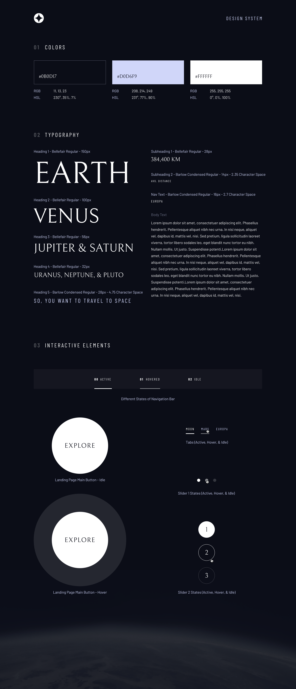
</td>
    <td>
    	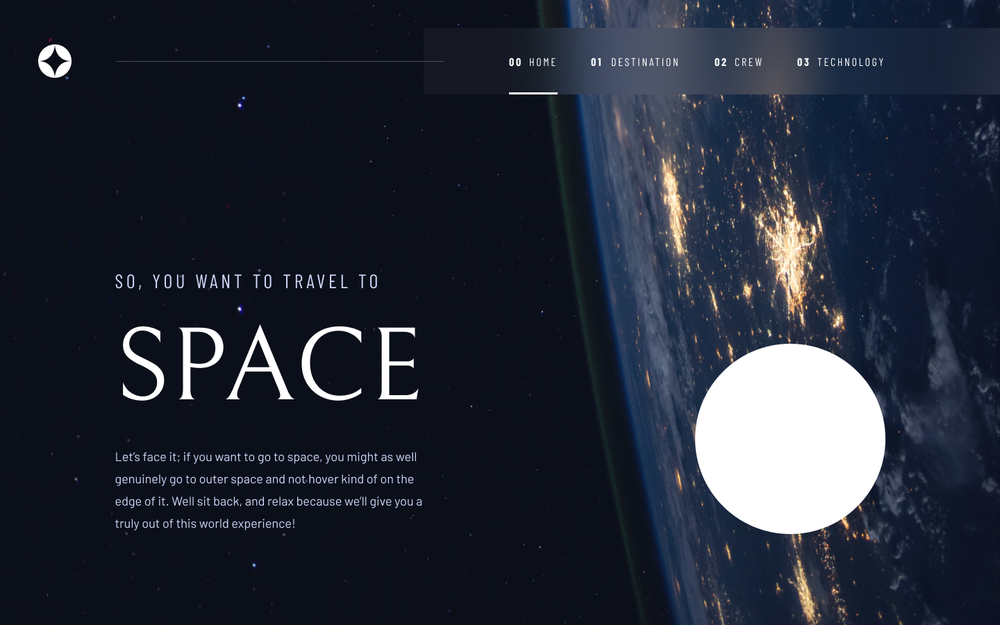
    	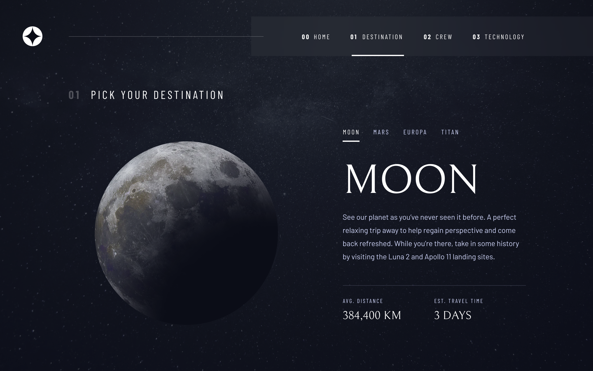

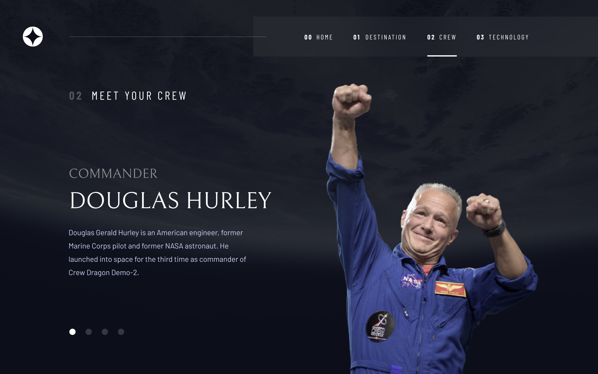

		</td>
 </tr>
  <tr>
    <td><b style="font-size:20px">Tablet</b></td>
    <td><b style="font-size:20px">Mobile</b></td>
 </tr>
 <tr>
    <td>
		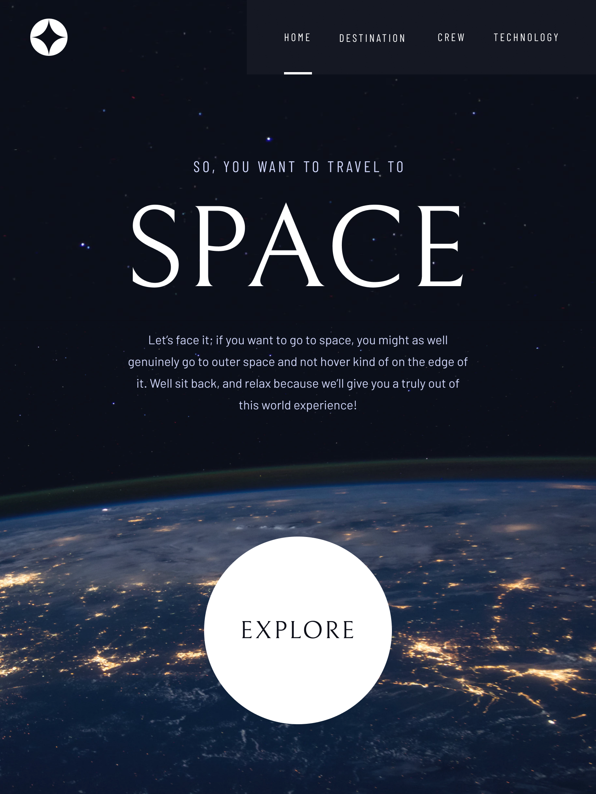
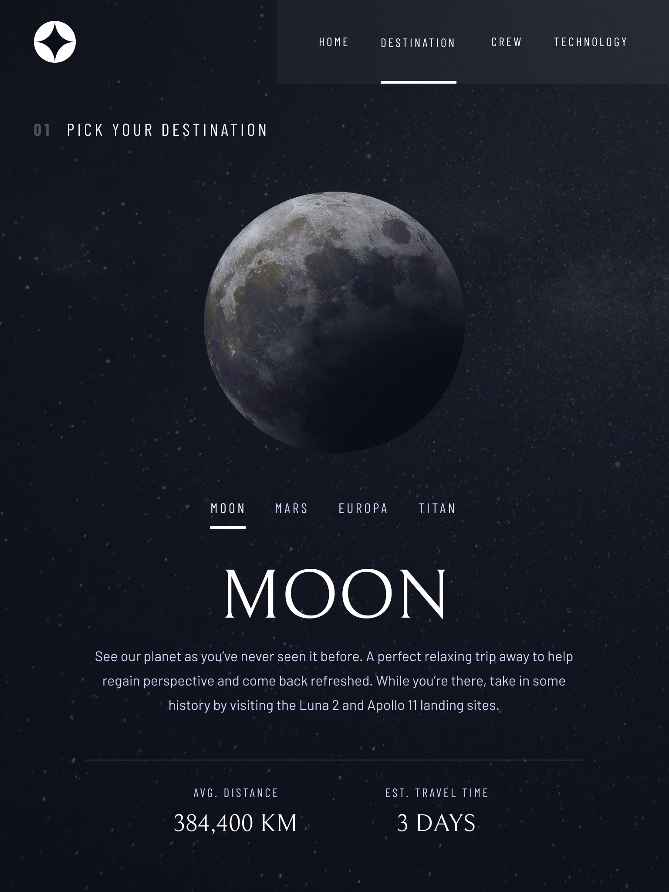
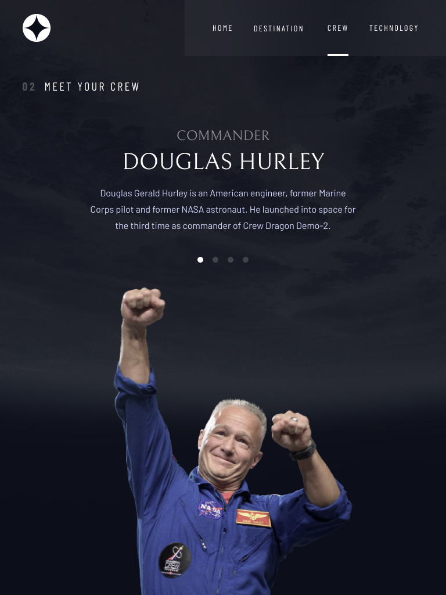
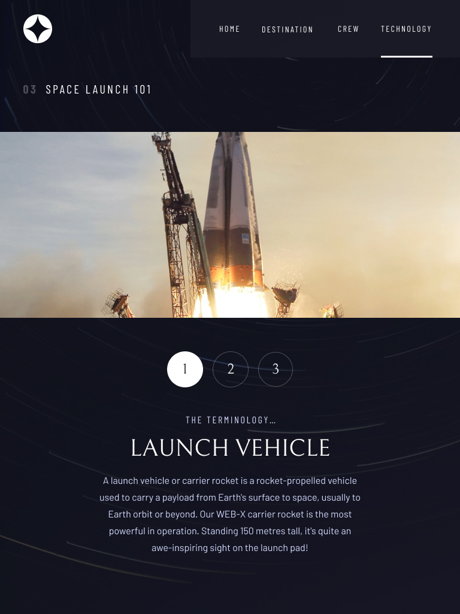
</td>
    <td>
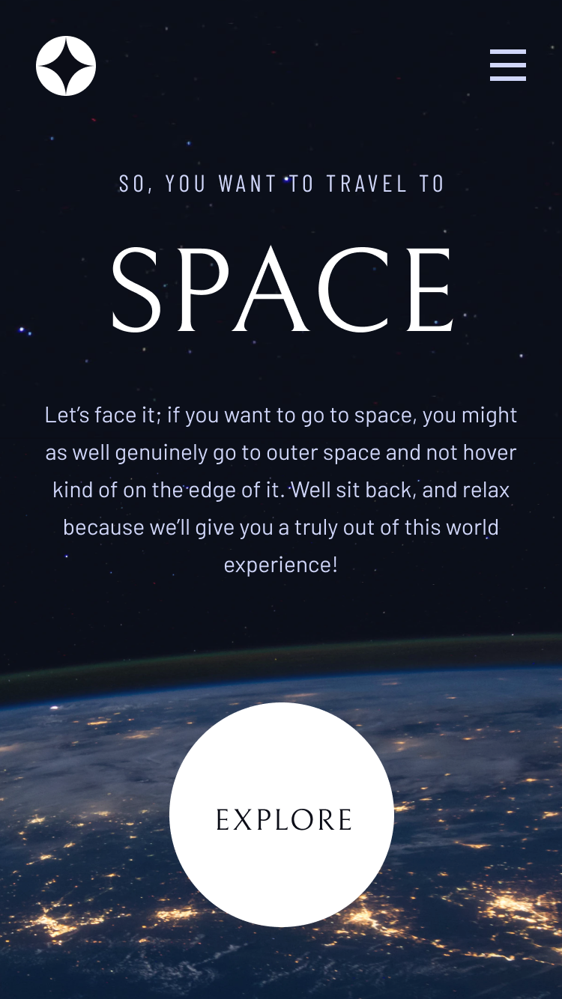
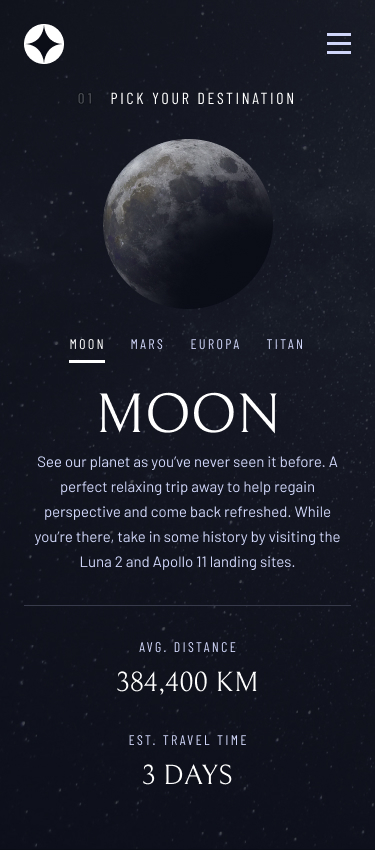
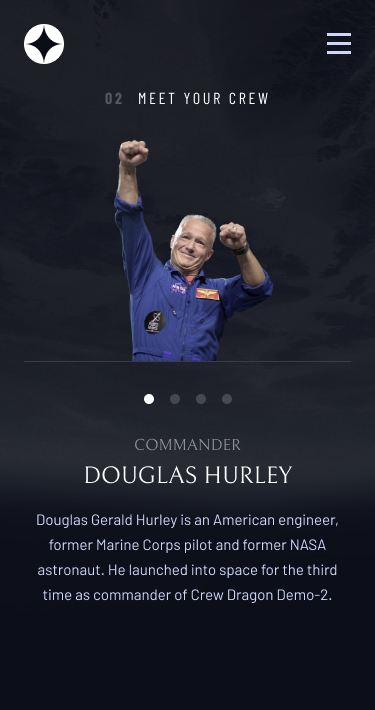
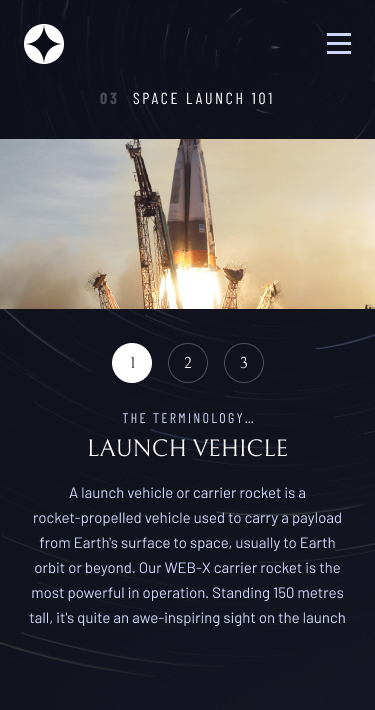
		</td>
 </tr>
</table>

### Links

- Solution URL : [https://github.com/thesohailjafri/fm-space-tourism-website](https://github.com/thesohailjafri/fm-space-tourism-website)
- Live Site URL : [https://fm-space-tourism-website.netlify.app/](https://fm-space-tourism-website.netlify.app/)

## My process

1. First i did mobile UI
2. Then i did desktop and tablet UI
3. Then i did the iterative design
4. Then i added JS logic for tabs and hover states

### Built with

- Semantic HTML5 markup
- Tailwind CSS v3
- Flexbox
- CSS Grid
- Mobile-first workflow

### What I learned

I practiced custom configuration for the Tailwind CSS framework. I also learned how to use the extend utility to create custom CSS classes.

```js
module.exports = {
  mode: 'jit',
  content: ['./src/**/*.{html,js}', './index.html'],
  theme: {
    fontFamily: {
      head: [' "Bellefair", serif'],
      subhead: ['"Barlow Condensed", sans-serif'],
      sans: ['"Barlow", sans-serif'],
    },

    extend: {
      borderWidth: {
        3: '3px',
        170: '170px',
      },
      colors: {
        'my-blue': '#D0D6F9',
        'my-black': '#0B0D17',
      },
      boxShadow: {
        'explore-none': '0px 0px 0px 0px rgba(255,255,255,.12)',
        'explore-sm': '0px 0px 0px 20px rgba(255,255,255,.12)',
        'explore-md': '0px 0px 0px 40px rgba(255,255,255,.12)',
        'explore-lg': '0px 0px 0px 60px rgba(255,255,255,.12)',
      },
      transitionProperty: {
        height: 'height',
        spacing: 'margin, padding',
      },
      letterSpacing: {
        wider: '0.1rem',
        widest: '0.2em',
      },
    },
  },
  plugins: [require('tailwindcss-filters')],
}
```

### Useful resources

- [tailwindcss.com](https://tailwindcss.com/) - Tailwind CSS documentation

## Author

- Website - [TheSohailJafri](https://thesohailjafri.netlify.app/)
- Frontend Mentor - [@thesohailjafri](https://www.frontendmentor.io/profile/thesohailjafri)
- Twitter - [@Sinja97881141](https://twitter.com/Sinja97881141)
