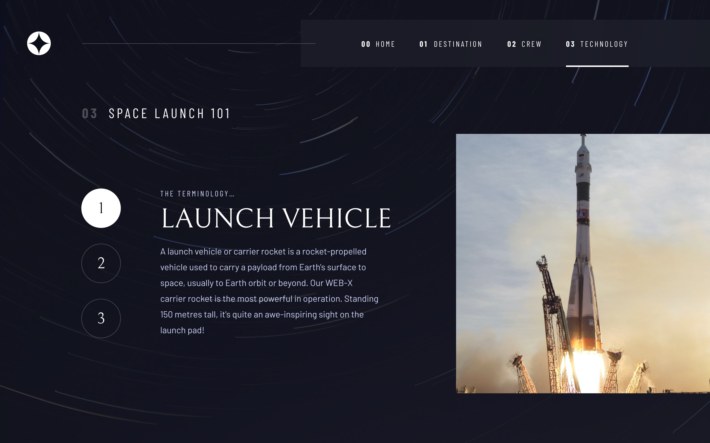

# Frontend Mentor - Space tourism website solution

This is a solution to the [Space tourism website challenge on Frontend Mentor](https://www.frontendmentor.io/challenges/space-tourism-multipage-website-gRWj1URZ3). Frontend Mentor challenges help you improve your coding skills by building realistic projects.

## Table of contents

- [Overview](#overview)
  - [The challenge](#the-challenge)
  - [Screenshot](#screenshot)
  - [Links](#links)
- [My process](#my-process)
  - [Built with](#built-with)
  - [What I learned](#what-i-learned)
  - [Continued development](#continued-development)
  - [Useful resources](#useful-resources)
- [Author](#author)
- [Acknowledgments](#acknowledgments)

**Note: Delete this note and update the table of contents based on what sections you keep.**

## Overview

### The challenge

Users should be able to:

- View the optimal layout for each of the website's pages depending on their device's screen size
- See hover states for all interactive elements on the page
- View each page and be able to toggle between the tabs to see new information

### Screenshot

<table border="0">
 <tr>
    <td><b style="font-size:20px">Design</b></td>
    <td><b style="font-size:20px">Desktop</b></td>
 </tr>
 <tr>
    <td>
		
</td>
    <td>
    	
    	



		</td>
 </tr>
  <tr>
    <td><b style="font-size:20px">Tablet</b></td>
    <td><b style="font-size:20px">Mobile</b></td>
 </tr>
 <tr>
    <td>
		


</td>
    <td>


		</td>
 </tr>
</table>

### Links

- Solution URL: [https://github.com/thesohailjafri/fm-space-tourism-website](https://your-solution-url.com)
- Live Site URL: [Add live site URL here](https://your-live-site-url.com)

## My process

### Built with

- Semantic HTML5 markup
- Tailwind CSS v3
- Flexbox
- CSS Grid
- Mobile-first workflow

### What I learned

I practiced custom configuration for the Tailwind CSS framework. I also learned how to use the extend utility to create custom CSS classes.

```js
module.exports = {
  mode: 'jit',
  content: ['./src/**/*.{html,js}', './index.html'],
  theme: {
    fontFamily: {
      head: [' "Bellefair", serif'],
      subhead: ['"Barlow Condensed", sans-serif'],
      sans: ['"Barlow", sans-serif'],
    },

    extend: {
      borderWidth: {
        3: '3px',
        170: '170px',
      },
      colors: {
        'my-blue': '#D0D6F9',
        'my-black': '#0B0D17',
      },
      boxShadow: {
        'explore-none': '0px 0px 0px 0px rgba(255,255,255,.12)',
        'explore-sm': '0px 0px 0px 20px rgba(255,255,255,.12)',
        'explore-md': '0px 0px 0px 40px rgba(255,255,255,.12)',
        'explore-lg': '0px 0px 0px 60px rgba(255,255,255,.12)',
      },
      transitionProperty: {
        height: 'height',
        spacing: 'margin, padding',
      },
      letterSpacing: {
        wider: '0.1rem',
        widest: '0.2em',
      },
    },
  },
  plugins: [require('tailwindcss-filters')],
}
```

### Continued development

Use this section to outline areas that you want to continue focusing on in future projects. These could be concepts you're still not completely comfortable with or techniques you found useful that you want to refine and perfect.

**Note: Delete this note and the content within this section and replace with your own plans for continued development.**

### Useful resources

- [Example resource 1](https://www.example.com) - This helped me for XYZ reason. I really liked this pattern and will use it going forward.
- [Example resource 2](https://www.example.com) - This is an amazing article which helped me finally understand XYZ. I'd recommend it to anyone still learning this concept.

**Note: Delete this note and replace the list above with resources that helped you during the challenge. These could come in handy for anyone viewing your solution or for yourself when you look back on this project in the future.**

## Author

- Website - [Add your name here](https://www.your-site.com)
- Frontend Mentor - [@yourusername](https://www.frontendmentor.io/profile/yourusername)
- Twitter - [@yourusername](https://www.twitter.com/yourusername)

**Note: Delete this note and add/remove/edit lines above based on what links you'd like to share.**

## Acknowledgments

This is where you can give a hat tip to anyone who helped you out on this project. Perhaps you worked in a team or got some inspiration from someone else's solution. This is the perfect place to give them some credit.

**Note: Delete this note and edit this section's content as necessary. If you completed this challenge by yourself, feel free to delete this section entirely.**
